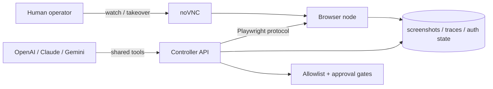

# Auto Browser

[](https://github.com/LvcidPsyche/auto-browser/actions/workflows/ci.yml)
[](./LICENSE)
[](./README.md)
[](./README.md)
[](https://glama.ai/mcp/servers/LvcidPsyche/auto-browser)
[](https://codespaces.new/LvcidPsyche/auto-browser?quickstart=1)


> **Give your AI agent a real browser, with a human in the loop.**

Auto Browser is an MCP-native browser control plane for authorized workflows. It gives MCP clients, LLM agents, and operators a shared Playwright browser with human takeover, reusable auth profiles, approvals, audit trails, and local-first deployment.

Works with:

- Claude Desktop
- Cursor
- any MCP client that can talk HTTP or stdio
- direct REST callers when you want curl-first control

## Why Auto Browser

- **MCP-native from day one.** The browser surface is already packaged as an MCP server instead of bolted on after the fact.
- **Human takeover when the web gets brittle.** noVNC keeps the same live session available when a person needs to step in.
- **Login once, reuse later.** Save named auth profiles and reopen fresh sessions that are already signed in.
- **Local-first by default.** Run the full stack on your own box with Docker Compose, or use Codespaces for a quick hosted demo.
- **Safety rails built in.** Approvals, operator identity, PII scrubbing, Witness receipts, and policy presets are all part of the product surface.
- **Governed skill induction.** Verified browser traces can become staged skill candidates with signed provenance, verifier adapters, and review-only graduation — agents that prove they can repeat themselves correctly, not just act once.

## Release Highlights (v1.2.0)

- **Verifiable Witness receipts.** Receipts were always hash-chained at write time; now you can check the chain on demand. `GET /sessions/{id}/witness/verify` and the read-only `browser.verify_witness` MCP tool walk the full chain and report the first divergent receipt if the log was altered, reordered, or truncated.
- **Sturdier session isolation.** Per-session browser containers now get memory/PID/CPU caps, and the controller reaps containers orphaned by a crash at startup.
- **Fresh dependency floor.** Playwright 1.60 (controller and browser-node aligned), uvicorn 0.49, and a unified, current user-agent pool replacing the stale Chrome 122-era defaults.
- **Quieter failure modes.** Cleanup and capture paths that previously swallowed errors now log them with context.
- **Release gates in CI** continue to enforce dependency audits, fixture evals, client tests, Python wheel builds, and the 80% controller coverage gate — now on Python 3.11 and 3.14.

See [CHANGELOG.md](./CHANGELOG.md) for the full release history.

## Good Fits

- internal dashboards and admin tools
- operator-assisted QA and browser debugging
- login-once, reuse-later account workflows
- brittle sites where a human may need to recover the flow
- MCP-powered agent workflows that need a real browser, not just HTML fetches

## Not the Goal

- CAPTCHA solving
- unauthorized scraping or account automation
- deceptive identity shaping or bypass tooling

## What You Get

| Browser Control | Operator Safety | Deployment and Integration |
| --- | --- | --- |
| Playwright-backed sessions with screenshots, DOM summaries, OCR excerpts, tab controls, downloads, and network inspection | approval gates, operator identity headers, audit events, PII scrubbing, Witness receipts, and protection profiles | MCP over HTTP, bundled stdio bridge, REST API, Docker Compose, Codespaces, auth profiles, and optional per-session isolation |

## Quickstart

```bash
git clone https://github.com/LvcidPsyche/auto-browser.git
cd auto-browser
docker compose up --build
```

That is enough for local development with the default settings.

Optional:

```bash
cp .env.example .env
make doctor
```

Run `make doctor` from a normal terminal with local Docker access and permission to open localhost sockets.

Open:

- API docs: `http://127.0.0.1:8000/docs`
- Operator dashboard: `http://127.0.0.1:8000/dashboard`
- Visual takeover: `http://127.0.0.1:6080/vnc.html?autoconnect=true&resize=scale`

All published ports bind to `127.0.0.1` by default.

## Try It in Codespaces

[](https://codespaces.new/LvcidPsyche/auto-browser?quickstart=1)

Codespaces provisions the stack automatically. The dashboard and noVNC tabs are usually ready in about 90 seconds.

## First Useful Demo

The highest-signal flow in this repo is:

1. create a session
2. log in manually if the site needs a human
3. save the session as a named auth profile
4. open a new session from that auth profile
5. continue work without reauthing

Start here:

- [`examples/login-and-save-profile.md`](./examples/login-and-save-profile.md)
- [`examples/README.md`](./examples/README.md)

Minimal session creation:

```bash
curl -s http://127.0.0.1:8000/sessions \
  -X POST \
  -H 'content-type: application/json' \
  -d '{"name":"demo","start_url":"https://example.com"}' | jq
```

Minimal observation:

```bash
curl -s http://127.0.0.1:8000/sessions/<session-id>/observe | jq
```

## MCP Clients

Auto Browser exposes:

- an HTTP MCP endpoint at `http://127.0.0.1:8000/mcp`
- convenience endpoints at `http://127.0.0.1:8000/mcp/tools` and `http://127.0.0.1:8000/mcp/tools/call`
- a bundled stdio bridge at [`scripts/mcp_stdio_bridge.py`](./scripts/mcp_stdio_bridge.py)

The default MCP tool profile is `curated`, which keeps the browser surface compact for better tool selection. If you want the full internal tool surface, set:

```bash
MCP_TOOL_PROFILE=full
```

Raw tool-call example:

```bash
curl -s http://127.0.0.1:8000/mcp/tools/call \
  -X POST \
  -H 'content-type: application/json' \
  -d '{
    "name":"browser.create_session",
    "arguments":{
      "name":"demo",
      "start_url":"https://example.com"
    }
  }' | jq
```

Client setup guides:

- [`docs/mcp-clients.md`](./docs/mcp-clients.md)
- [`examples/claude-desktop-setup.md`](./examples/claude-desktop-setup.md)
- [`examples/cursor-mcp-setup.md`](./examples/cursor-mcp-setup.md)
- [`examples/claude_desktop_config.json`](./examples/claude_desktop_config.json)

## Convergence Harness

Auto Browser ships a Stage 0 convergence harness for Agent Skill Induction. It runs a structured task contract, records tamper-checked traces, verifies completion, and writes a staged skill candidate with signed provenance. Generated skills are staged only — promotion stays explicit and reviewed.

Read-only inspection tools (`harness.list_runs`, `harness.get_status`, `harness.get_trace`) are exposed in the default `curated` MCP tool profile so agents can introspect harness state without elevated access. Convergence runs, drift checks, candidate management, and graduation require `MCP_TOOL_PROFILE=full`, or can be invoked directly over REST.

Start with [`docs/convergence-harness.md`](./docs/convergence-harness.md). A deterministic local smoke is:

```bash
python -m controller.harness.run --contract evals/contracts/example_read.json --mock-final-url https://example.com --mock-final-text "Example Domain"
```

For MCP clients, set `MCP_TOOL_PROFILE=full` to expose the `harness.*` tools.

## Security and Compliance

For a real private deployment, set at least:

```bash
APP_ENV=production
API_BEARER_TOKEN=<strong-random-secret>
REQUIRE_OPERATOR_ID=true
AUTH_STATE_ENCRYPTION_KEY=<44-char-fernet-key>
REQUIRE_AUTH_STATE_ENCRYPTION=true
REQUEST_RATE_LIMIT_ENABLED=true
METRICS_ENABLED=true
STEALTH_ENABLED=false
```

`COMPLIANCE_TEMPLATE` can apply a preconfigured posture at startup:

| Preset | Auth Encryption | Operator ID | PII Scrub | Isolation | Max Session Age |
| --- | --- | --- | --- | --- | --- |
| `strict` | required | required | all layers | `docker_ephemeral` | 4h |
| `balanced` | - | required | network + text | shared | 24h |

Both presets require upload approvals and enable Witness receipts. Startup writes the applied policy to `/data/compliance-manifest.json`. The legacy names (`HIPAA`, `SOC2`, `GDPR`, `PCI-DSS`) still work as deprecated aliases and emit a warning at startup.

Example:

```bash
COMPLIANCE_TEMPLATE=strict docker compose up
```

For deployment details, hosted Witness notes, CLI auth modes, and reverse-SSH guidance, see:

- [`docs/deployment.md`](./docs/deployment.md)
- [`docs/production-hardening.md`](./docs/production-hardening.md)

## Architecture at a Glance



Core components:

- `browser-node/` runs Chromium, Xvfb, x11vnc, and noVNC
- `controller/` exposes the FastAPI controller, MCP transport, policy rails, and orchestration endpoints
- `data/` holds runtime artifacts, auth state, approvals, audit logs, and optional CLI caches
- `scripts/` contains local helpers for doctor, smoke tests, bridges, and release checks

## Repo Guide

| Path | What It Contains |
| --- | --- |
| [`controller/`](./controller/) | controller API, MCP transport, tests, and packaging |
| [`browser-node/`](./browser-node/) | browser runtime and Playwright connection layer |
| [`examples/`](./examples/) | copy-paste flows and MCP client setup |
| [`integrations/langchain/`](./integrations/langchain/README.md) | LangChain, LangGraph, and CrewAI adapters |
| [`docs/`](./docs/) | architecture, deployment, hardening, and launch docs |
| [`scripts/`](./scripts/) | doctor, smoke harnesses, stdio bridge, and auth helpers |
| [`ops/`](./ops/) | supporting service templates and operational assets |

## Common Commands

| Command | Purpose |
| --- | --- |
| `make help` | list available repo commands |
| `make lint` | run Ruff checks on app, tests, and helper scripts |
| `make test` | run controller tests in Docker |
| `make test-local` | run controller tests on host Python 3.10+ |
| `make eval` | run deterministic provider/profile eval scoring |
| `make doctor` | run the local readiness smoke |
| `make release-audit` | run the fuller release-validation pass |
| `make smoke-isolation` | verify per-session Docker isolation |
| `make smoke-reverse-ssh` | verify reverse-SSH remote access |

## Documentation Map

| If You Want To... | Start Here |
| --- | --- |
| understand the system shape | [`docs/architecture.md`](./docs/architecture.md) |
| connect Claude Desktop or Cursor | [`docs/mcp-clients.md`](./docs/mcp-clients.md) |
| run the curl-first examples | [`examples/README.md`](./examples/README.md) |
| deploy on a trusted host | [`docs/deployment.md`](./docs/deployment.md) |
| review production constraints | [`docs/production-hardening.md`](./docs/production-hardening.md) |
| run the convergence harness | [`docs/convergence-harness.md`](./docs/convergence-harness.md) |
| inspect release history | [`CHANGELOG.md`](./CHANGELOG.md) |
| see where the project is headed | [`ROADMAP.md`](./ROADMAP.md) |

## Contributing

If you want to help, start with:

- [`CONTRIBUTING.md`](./CONTRIBUTING.md)
- [`docs/good-first-issues.md`](./docs/good-first-issues.md)
- [`CODE_OF_CONDUCT.md`](./CODE_OF_CONDUCT.md)

If Auto Browser is useful, a star helps other people find it. Sponsorship and tip options live in [`TIPS.md`](./TIPS.md).
