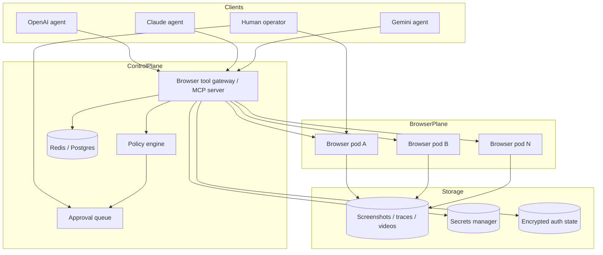

# Auto Browser Architecture

## Goal

Give multiple LLMs a shared, screen-aware browser harness that can:
- see the current browser viewport
- understand what is clickable or typeable
- execute actions through a stable API
- hand control to a human when needed
- keep an audit trail of what happened

## Non-goals

- CAPTCHA solving
- using real personal browser profiles

## The core idea

Split the system into **three planes** instead of forcing one tool to do everything.

### 1. Visual plane
What the model sees:
- viewport screenshot
- recent before/after screenshots around actions
- live takeover view through noVNC

### 2. Structured plane
What the model reasons over:
- URL and title
- interactable elements with stable `element_id`
- selector hints and bounding boxes
- console and page errors
- accessibility summaries and focused-node context
- optional OCR excerpts when the DOM is weak

### 3. Action plane
What actually touches the browser:
- Playwright actions
- policy checks before risky actions
- trace capture and action logs
- auth-state save/restore

## Why this shape is better than “just Playwright”

Raw Playwright is a strong executor, but by itself it does not define:
- how multiple LLMs share the same browser tool surface
- how screenshots and action history are fed back in a consistent way
- how humans take over visually mid-flow
- how you gate risky actions and preserve artifacts

This scaffold makes Playwright the execution engine and wraps it in an operator system.

## Recommended production architecture

## Session model

One session should own:
- one browser context
- one primary page
- one artifact directory
- one optional auth-state file
- one optional reusable auth-profile reference
- one lock so actions happen in order

Why:
- per-session isolation is easier to reason about
- auth state stays scoped to a single workflow or account
- replaying artifacts is simple

### POC constraint

This scaffold intentionally limits the node to **one active session**. The browser node exposes one X display and one noVNC surface, so human takeover is global to that desktop. In production, move to one browser node per session or per account.

Within that limitation, the controller now still scopes working state per session:
- per-session artifact directory
- per-session auth-state root
- per-session upload staging root
- durable session metadata with explicit isolation descriptors

### Optional docker-ephemeral isolation path

This repo now also includes an optional `docker_ephemeral` session mode:
- the controller provisions a fresh browser-node container per session
- each isolated session gets its own Playwright endpoint
- each isolated session gets its own published noVNC/VNC port pair
- session summaries/observations now expose session-specific `remote_access` state so operators can see whether an isolated takeover URL is local-only or remotely reachable
- the shared reverse-SSH metadata is not blindly reused for those takeover URLs
- when isolated takeover ports are only local, the controller can now open a per-session reverse-SSH tunnel and advertise that remote URL instead
- those per-session tunnels can target the isolated browser container directly over the Docker network instead of depending on host hairpin access

That is the first real path toward true per-account browser isolation without rewriting the controller contract.

## Browser node

The browser node in this POC is a single container with:
- Chromium
- Xvfb
- Fluxbox
- x11vnc
- noVNC
- a Playwright browser server exposed on port `9223`

This is the visual execution box.

### Why not Brave

Brave adds extra variability and browser-specific behavior without helping the controller model. For automation and reproducibility, use **Chromium or Chrome for Testing**.

### Chrome security note

Chrome tightened remote debugging behavior in **March 2025**. That is one reason this POC now prefers **Playwright `launchServer` / `connect`** over CDP attach. It keeps the controller on Playwright protocol and avoids leaning on raw remote-debugging ports as the core control path.

## Controller

The controller owns:
- session creation and teardown
- host allowlist checks before navigation
- action execution via Playwright
- screenshot capture and artifact storage
- interactable extraction and stable element IDs
- auth-state save/restore with optional encryption + max-age enforcement
- accessibility-outline capture for stronger screen understanding
- OCR screenshot extraction for text that DOM/accessibility misses
- trace export on close
- an optional built-in agent runner over REST for OpenAI / Claude / Gemini
- durable background job execution for queued REST agent step/run requests
- audit events with operator identity tagging
- an MCP JSON-RPC browser tool gateway with session-aware `/mcp` transport and a smaller curated default tool profile
- optional docker-managed per-session browser containers for true runtime isolation
- optional SQLite backing for approvals and audit retention

### Why the controller should be the only thing LLMs talk to

Because you want one stable contract:
- `create_session`
- `observe`
- `click`
- `type`
- `scroll`
- `upload`
- `save_storage_state`
- `request_human_takeover`
- `close_session`

That lets you swap models without rewriting browser logic.

## Policy rails

This POC includes real controller-side rails:
- **host allowlist** for navigation
- **read vs write action classes** in action logs
- **approval queue** for uploads
- **approval queue** for model-declared post / payment / account-change / destructive steps
- **action verification** from before/after page signals

Production should add more:
- domain classes: read-only vs write-capable
- stronger domain policy by account/workflow
- per-model scopes and quotas

## Human takeover

noVNC is the recovery path.

Use it when:
- login is brittle
- MFA is required
- the model is uncertain
- a site changes its UI
- you want to supervise before a sensitive step

The point is not to fully remove humans. The point is to **keep workflows moving** when automation hits edge cases.

## Why screenshots plus interactable IDs matter

Screenshot-only control makes models guess. DOM-only control makes them blind.

The better loop is:
1. capture a screenshot
2. tag and extract interactables
3. let the model choose an `element_id` or selector
4. execute the action
5. capture the after-state
6. verify what changed with URL/title/focus/text/DOM-count signals

That is the minimal reliable operator loop.

## Production roadmap

### Phase 1 — current POC
- single browser node
- single controller
- noVNC takeover
- durable session registry under `/data/sessions` with optional Redis backing
- durable agent job queue under `/data/jobs`
- local artifact volume
- text-excerpt and DOM-outline perception summaries
- accessibility-outline summaries from the Playwright accessibility tree
- OCR excerpts and bounding boxes from screenshots
- action verification in action logs/responses
- encrypted auth-state support
- audit log at `/data/audit/events.jsonl`
- MCP JSON-RPC `/mcp` transport plus `/mcp/tools` + `/mcp/tools/call` convenience endpoints
- optional `docker_ephemeral` isolated browser containers launched per session
- optional controller-managed reverse-SSH session tunnels for isolated noVNC takeover ports
- optional SQLite state DB for approvals + audit queries/retention

### Phase 2 — private remote access
- put the stack behind Tailscale or Cloudflare Access
- or use the optional reverse-SSH sidecar in this repo to pinhole the shared API + noVNC ports through a bastion
- or let the controller broker per-session reverse-SSH tunnels for isolated noVNC takeover ports
- keep reverse binds on `127.0.0.1` unless you intentionally opt into `unsafe-public`
- add TLS and auth at the gateway
- remove public raw debugging ports

### Phase 3 — multi-session isolation
- one container or VM per account
- Redis / Postgres for session registry
- per-session CPU/memory quotas

### Phase 4 — better model ergonomics
- built-in retry semantics
- optional OCR / accessibility snapshots
- route selection between DOM-click and coordinate-click
- add streaming/SSE on top of the current MCP transport when clients need server-pushed events

### Phase 5 — enterprise hardening
- approval workflows backed by a database + operator identity
- audit log export and retention controls
- secret rotation
- SSO and operator identity

## Operational advice

- prefer APIs over browser automation when an official API exists
- keep real-world side effects behind approval gates
- never share one browser profile across multiple identities
- store screenshots, traces, and action logs by session ID
- make every action replayable

## Adapter/orchestrator layer

The current POC now has a dedicated orchestration layer:
- `ProviderRegistry` advertises configured providers
- each provider adapter converts screenshot + observation into one strict action decision
- `BrowserOrchestrator` turns that decision into controller actions
- step and run logs are stored in each session artifact directory

This keeps provider-specific API logic out of the browser execution path.
